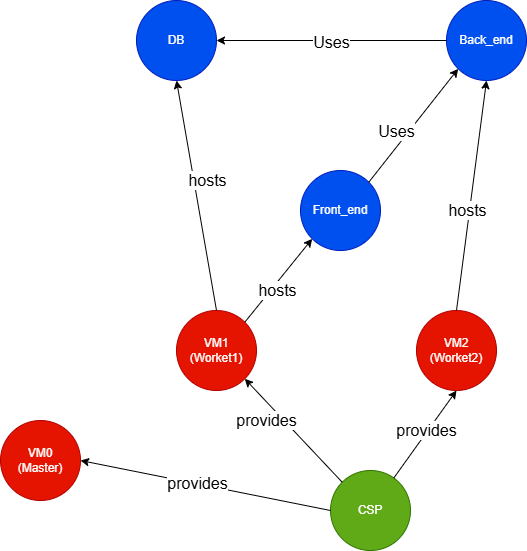

# Bank payment management system
To install this application on the cluster, you need the yaml files in `miscConfig/bank`.

The following image describes how the application is intended to be deployed using MACM formalism.


## 1. Database setup
1. download the `mysql-deployment.yaml` file on your master
2. change row 29 with the name of the worker you want to use
3. run
  ```sh
  kubectl create secret generic backend-secrets --from-literal=db_password='rootpassword' --from-literal=secret_key='rootpassword'
  ```
  to create the secrets i.e., the database access credentials.
4. run
  ```sh
  kubectl apply -f mysql-deployment.yaml
  ```
  to apply the deployment on the cluster 
5. run
  ```sh
  kubectl get pods
  ```
  to confirm that the pod is up and running (you can even use the kubesphere console)
6. run
  ```sh
  kubectl exec -it <POD_NAME> -- mysql -u root -p
  ```
  to access the pod and, when required, insert `rootpassword` as access password. 
7. run
  ```sh
  show databases;
  ```
  to confirm that bankdb has been created. If not run
  ```sh
  create database bankdb;
  ```
8. run
  ```sh
  use bankdb;
  ```
  to enter the database
9. build `users` and `transactions` tables with the following commands:
  ```sql
  CREATE TABLE users ( 
	    id INT AUTO_INCREMENT PRIMARY KEY,
	    name VARCHAR(50) NOT NULL,
	    surname VARCHAR(50) NOT NULL,
	    email VARCHAR(100) NOT NULL UNIQUE,
	    password VARCHAR(255) NOT NULL,
	    balance DECIMAL(10,2) NOT NULL DEFAULT 0.00
	);

  CREATE TABLE transactions(
      id INT AUTO_INCREMENT PRIMARY KEY,
      id_sender INT NOT NULL,
      email_sender VARCHAR(255) NOT NULL,
      id_receiver INT NOT NULL,
      email_receiver VARCHAR(255) NOT NULL,
      amount DECIMAL(10,2) NOT NULL,
      date TIMESTAMP DEFAULT CURRENT_TIMESTAMP,
      description TEXT NULL
  );
  ```


backend_deployment.yaml
frontend_deployment.yaml


