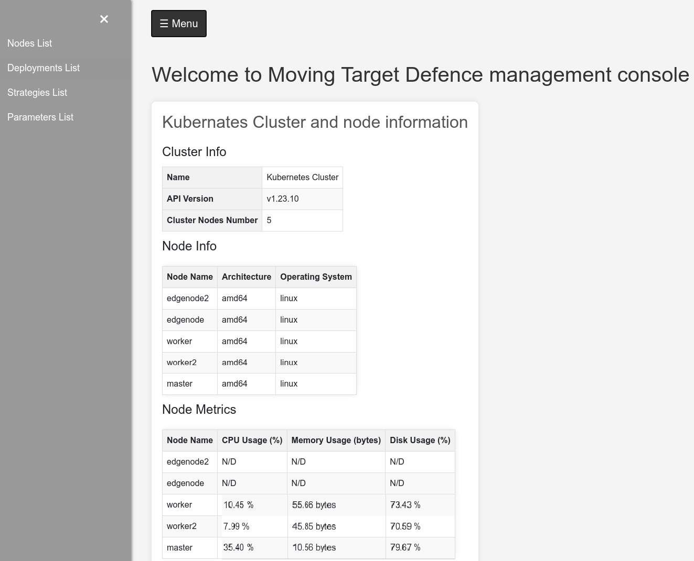
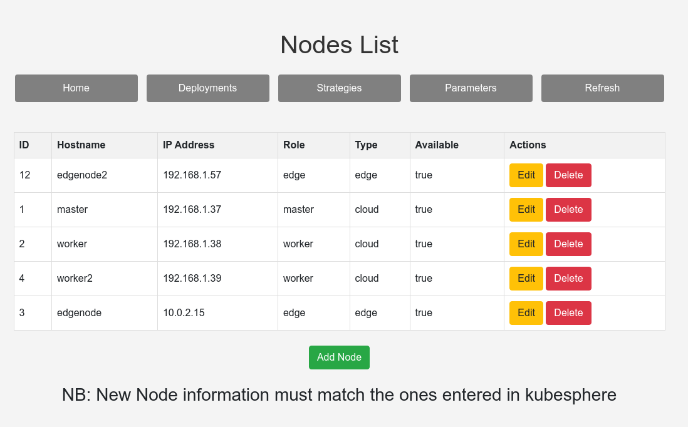
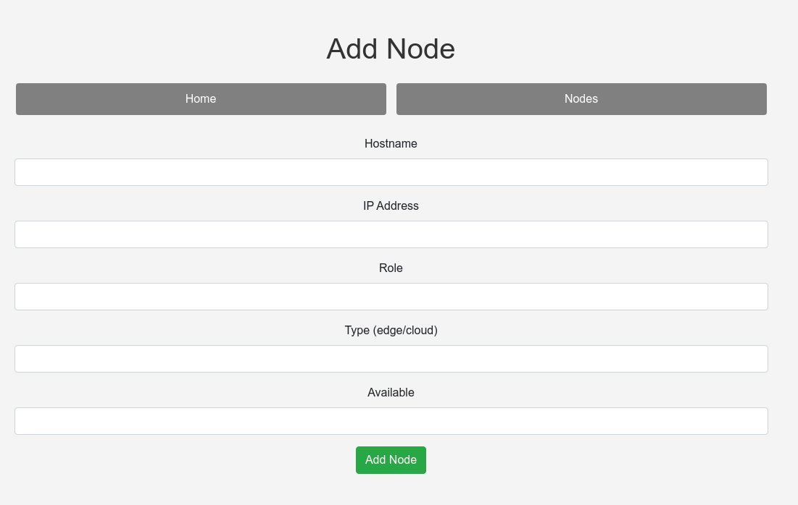
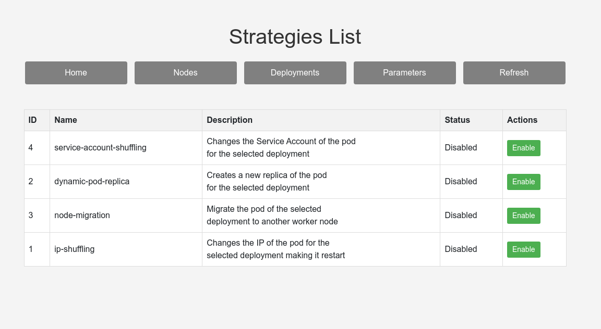
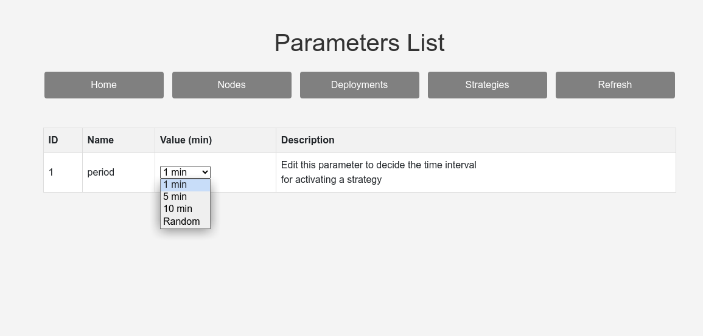

# MTD-manager-console
This is a JAVA application for managing the Moving Target Defense in cloud environment developed in collaboration with `University of Naples Federico II` in the context of [DEFEDGE - PRIN PNRR 2022 Project](https://github.com/DEFEDGE) (reference autor daniele.iorio2@unina.it).
 
To use this application, you need to install a kubernetes cluster following this file [How to Kubernetes](How_to_kubernetes.md) and setup the environment following [Application setup](Application_setup.md).
Performance test explaination can be found in [Performance test](Performance_test.md).

The implemented techniques are:
1. `IP shuffling` (Changes the IP of the pod for the selected deployment making it restart)
2. `Service Account shuffling` (Changes the Service Account of the pod for the selected deployment)
3. `Dynamic Replica` (Creates a new replica of the pod for the selected deployment)
4. `Node Migration` (Migrate the pod of the selected deployment to another worker node)

The application is intuitive and easy to use.
- The `landing page` is the following:



in which information about the cluster and the single node are automatically retrieved.

- In the `Nodes List` page





the user can manage the node lifecycle (using add, edit and delete function).

- In the `Deployment List` page


the user can manage the deployment lifecycle (using add, edit and delete function) and can decide on which deplyment enable the MTD.  

N.B. The name of the deployment is the corresponding workload. 


- In the `Strategies List` page



the user can enable one or more strtategy that will affect the enabled deployment.
In this case the user cannot edit the strategy directly in the UI but needs to modify the source code to change/add implementation logic.
Whenever a new strategy is created, the following steps are needed:
1. the new classNameService.java file implementing the technique must be stored in the `service` folder
2. insert in the `PGAdmin database` the new corresponding technique using
   ```sh
   INSERT INTO mtdmanager.strategy VALUES ('techniqueName', false, 'fixed', n);
   ```
   where n is the progressive technique number 
3. modify `deplo.js` script to adapt the dropdown menu to the new scenario adding
   ```sh
   <option value="n" ${deployment.strategy === n ? 'selected' : ''}>techniqueName</option>
   ```
   after row 35.
4. in `strats.js` script add the strategy description with the ID provided in the `strategyDescriptions` const:
   ```sh
   ID: 'Strategy description',
   ```
5. in `add-deployment.js` update the function `isValidStrategy` (row 14) adding the number of the new technique
6. in `MTDStrategyService.java` add the new related thread to activate the service itself upon startup with
   ```sh
   new Thread(classNameService, "name_alias").start();
   ```

- In the `Parameter` page



the user can set the preferred execution window.
