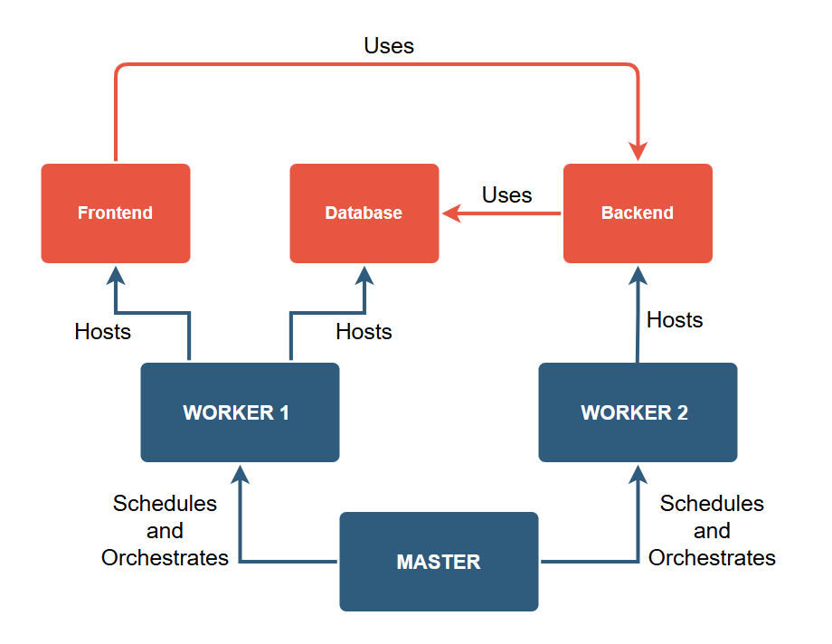

# Bank payment management system
This application simulates a money transfer system between registered users.

To install this application on the cluster, you need the yaml files in `miscConfig/bank`.

The following image describes at a high level how the application is intended to be deployed on the nodes.


The test banking application was designed with a simplified microservices architecture, consisting of three main components:

* **Frontend:** The web user interface accessed by users. It is developed using standard web technologies (HTML, CSS, JavaScript).
* **Backend:** The application service that handles business logic, user operations (login, registration, transfers, etc.), and interaction with the database. It is implemented using the Python Flask framework.
* **Database:** A MySQL instance used to store user data (credentials, balance) and transactions.

The typical interaction sequence for a user operation (such as viewing the dashboard or making a transfer) follows the logical flow: User (via Frontend) -> Backend -> Database -> Backend -> Frontend (page refresh). For requirements and security controls implemented, refer to [this file](Bank_req_sec.md).

## 1. Namespace Creation
Create a Kubernetes namespace:
```bash
kubectl create namespace bank-project
```
---
## 2. TLS Configuration for HTTPS connections
### 2.1 Self-signed Certificate generation
```bash
openssl req -x509 -nodes -newkey rsa:2048 \
  -keyout tls.key -out tls.crt -days 365 \
  -subj "/CN=bank.local"
```
This will generate `tls.crt` (certificate) and `tls.key` (private key).

### 2.2 TLS Secret Creation
Create the TLS secret in the bank-project namespace using kubectl:
```bash
kubectl create secret tls https-secrets \
  --cert=tls.crt \
  --key=tls.key \
  -n bank-project
```

### 2.3 Database Secret Creation
Creation of the secret containig MySQL credentials and application secret:
```bash
kubectl create secret generic backend-secrets \
  --from-literal=db_password='password' \
  --from-literal=secret_key='password' \
  -n bank-project
```
---
## 3. Ingress-Nginx Controller Installation
The Ingress Controller is responsible for managing external access to services exposed via Ingress Resources via NodePort.
### 3.1 Installation
```bash
kubectl apply -f https://raw.githubusercontent.com/
  kubernetes/ingress-nginx/controller-v1.12.1/
  deploy/static/provider/baremetal/deploy.yaml
```

### 3.2 Installation Verification
```bash
kubectl get pods -n ingress-nginx --watch
```
Wait untill the following pods show:
•	ingress-nginx-controller: Running (1/1) - main controller
•	ingress-nginx-admission-create: Completed - configuration job
•	ingress-nginx-admission-patch: Completed - configuration job

### 3.3 NodePort Identification
```bash
kubectl get svc -n ingress-nginx
```
In the PORT(S) column look for the 443 port mapping (e.g., 43:32313/TCP specifies that NodePort HTTPS is 32313.)

---
## 4. Configuring Local Access (Hosts File)

To access the application using the name `bank.local`, you need to map this name to the IP address of the node where the Ingress Controller is running in your local machine's `hosts` file.

1.  Open the `hosts` file on your local machine with administrator privileges:
    * **Windows:** `C:\Windows\System32\drivers\etc\hosts`
    * **Linux/macOS:** `/etc/hosts`
2.  Add a line in the format:
    ```
    <FRONTEND_WORKER_IP> bank.local
    ```
    Replace `<FRONTEND_WORKER_IP>` with the IP address of the frontend's worker node where the Ingress Controller is running.
3.  Save the `hosts` file.
---
# Application Deployment
To deploy the application, you'll need the following files in `MTD-manager-console/miscConfig/bank`
•  mysql_deployment.yaml
•	frontend_deployment.yaml
•	backend_deployment.yaml
•	bank_ingress.yaml

## 1. Database Deployment
We will install MySQL as the backend database for the application and configure the necessary tables.

1.  On the master node, create a Kubernetes Secret for the database credentials. This secret will be used by the application backend to connect to MySQL.

    ```bash
    kubectl create secret generic backend-secrets --from-literal=db_password='rootpassword' --from-literal=secret_key='rootpassword' -n bank-project
    ```

2.  Open the `mysql_deployment.yaml` file.
3.  Find the line containing `kubernetes.io/hostname: worker1` (typically around line 28) and modify `worker1` with the name of the specific node where you want the MySQL pod to run. This is useful for ensuring the persistent volume is always attached to the same node.
4.  Change the `Liveness Probe` by modifying the `initialDelaySeconds` from 30 to 120 seconds avoiding pod crashloopbackoff issues
   ```bash
   sed -i 's/initialDelaySeconds: 30/initialDelaySeconds: 120/' mysql_deployment.yaml
   ``` 
5.  Save the changes to the `mysql_deployment.yaml` file.
6.  Apply the MySQL deployment in the `bank-project` project:

    ```bash
    kubectl apply -f mysql_deployment.yaml -n bank-project
    ```

7.  Wait for the MySQL pod to be in the `Running` state. You can verify this with the command `kubectl get pods -n bank-project`. Note down the exact name of the pod (it will be something like `mysql-xxxxxxxxxx-xxxxx`).

8.  Access the shell of the MySQL pod:
     ```bash
     kubectl exec -it <MYSQL_POD_NAME> -n bank-project -- sh # Replace `<MYSQL_POD_NAME>` with the exact pod name noted in the previous step.
     ```
9.  Once inside the pod's shell, access the MySQL client:
     ```bash
     mysql -u root -p
     ```

10. When prompted, enter the password for the `root` user, which is `rootpassword` (as defined in the Secret).
11. Once inside the MySQL console, view the existing databases:

    ```sql
    SHOW DATABASES;
    ```

12. The `bankdb` database should have been automatically created by the deployment (if it is not present, create it `CREATE DATABASE bankdb;`) and access it:

    ```sql
    USE bankdb;
    ```

13. Create the `users` table to store user information:

    ```sql
    CREATE TABLE users (
        id INT AUTO_INCREMENT PRIMARY KEY,
        name VARCHAR(50) NOT NULL,
        surname VARCHAR(50) NOT NULL,
        email VARCHAR(100) NOT NULL UNIQUE,
        password VARCHAR(255) NOT NULL,
        balance DECIMAL(10,2) NOT NULL DEFAULT 0.00
    );
    ```

14. Create the `transactions` table to record financial movements:

    ```sql
    CREATE TABLE transactions (
        id INT AUTO_INCREMENT PRIMARY KEY,
        id_sender INT NOT NULL,
        email_sender VARCHAR(255) NOT NULL,
        id_receiver INT NOT NULL,
        email_receiver VARCHAR(255) NOT NULL,
        amount DECIMAL(10,2) NOT NULL,
        date TIMESTAMP DEFAULT CURRENT_TIMESTAMP,
        description TEXT NULL
    );
    ```

15. (Optional) Populate the `users` table with some sample data:

    ```sql
    INSERT INTO users (name, surname, email, password, balance)
    VALUES
    ('Giovanni', 'Rossi', 'giovanni.rossi@email.com', 'pbkdf2:sha256:260000$D4kuLfbAZTEqwgNs$2a54fd573638b8579e8fe5065de2b98463ffb3063820938f6c2b965c969bbf2d', 500.00),
    ('Maria', 'Bianchi', 'maria.bianchi@email.com', 'pbkdf2:sha256:260000$cPNofnRIMNt88UYH$3bdcc1f225c222cb9cd1b9eac5f38e15434653848d01e81114c1a67eda0b2fc7', 1000.00),
    ('Luca', 'Verdi', 'luca.verdi@email.com', 'pbkdf2:sha256:260000$eWmItAkdLFqZhggI$d7e39d8c9e101f6bbb98e641c1ad2c476ff5aa172d5c955b27683944444340f2', 1500.00),
    ('Anna', 'Neri', 'anna.neri@email.com', 'pbkdf2:sha256:260000$vyyRyHIxtVKyr5Sk$11776308bf0b4a9d4bc6a6d6f02d2177db672ebcf0d8e1ea7be8679cf85af0fe', 2000.00),
    ('Marco', 'Gialli', 'marco.gialli@email.com', 'pbkdf2:sha256:260000$23uECGvUNaUrWLCb$2fda8024bec75830fe97d7279867652b2933dc00d870fbfa9968c643b8c1228e', 2500.00);
    ```

    **SECURITY NOTE:** Passwords in the database are stored in hashed format to ensure data security at rest. To log in to the application dashboard with the sample users above, **the password to use is the user's first name with the first letter capitalized** (e.g., for user "Giovanni Rossi" the email is `giovanni.rossi@email.com` and the password is `Giovanni`).
---
## 2. Deploying Frontend, Ingress, and Backend components

Now we will deploy the application components and configure the Ingress Resource to route traffic.

1. On the master node apply the frontend deployment in the `bank-project` project:

    ```bash
    kubectl apply -f frontend_deployment.yaml -n bank-project
    ```

2. Before applying the Ingress Resource in the `bank-project` project, Add `ingressClassName: nginx` below every `spec:` block and verify that `secretName` is equal to the TLS secret created (https-secrets). Then execute:
    ```bash
    kubectl apply -f bank_ingress.yaml -n bank-project    # ingress deployment
    kubectl get ingress -n bank-project                   # to verify that both ingress are of NGINX class 
    ```
3. Open the `backend_deployment.yaml` file and change nodePort to the HTTPS one applied before (or use `sed -i 's/<MODIFY HERE>/32313/g' backend_deployment.yaml`) and save the changes. This tells the backend which port the application will be accessible on from the frontend via the Ingress.
4. Verify the change using
   ```bash
   grep "bank.local" backend_deployment.yaml
   ```
   The environment virables should show somenthing like `value: "https://bank.local:32313"`
5. Apply the backend deployment in the `bank-project` project:
    ```bash
    kubectl apply -f backend_deployment.yaml -n bank-project
    ```
---
## 3. Verify Application Access
1. Verify the pod status using
```bash
kubectl get pods -n bank-project
```
front-end-xxxxxxxxx-xxxxx (Frontend), backend-xxxxxxxxx-xxxxx (Backend), mysql-xxxxxxxxx-xxxxx (Database) must be up and running.

2. Application Access
Once all components have been deployed and are in the `Running` state (you can verify this in the Kubesphere UI in the Pods section of the `bank-project`), the application will be accessible.

1.  Open a web browser on the machine where you modified the `hosts` file.
2.  Navigate to the URL: `https://bank.local:<NodePort>`
    Replace `<NodePort>` with the actual NodePort you noted in step 6.4 (e.g., `https://bank.local:30662`).

You have successfully completed the deployment of the banking application on Kubesphere. You should now be able to access the application dashboard and, optionally, use the sample user credentials entered into the database to log in.

Now you can proceed to customize Grafana introducing new dashboards  [monitoring the application](Bank_Grafana_Setup.md).
